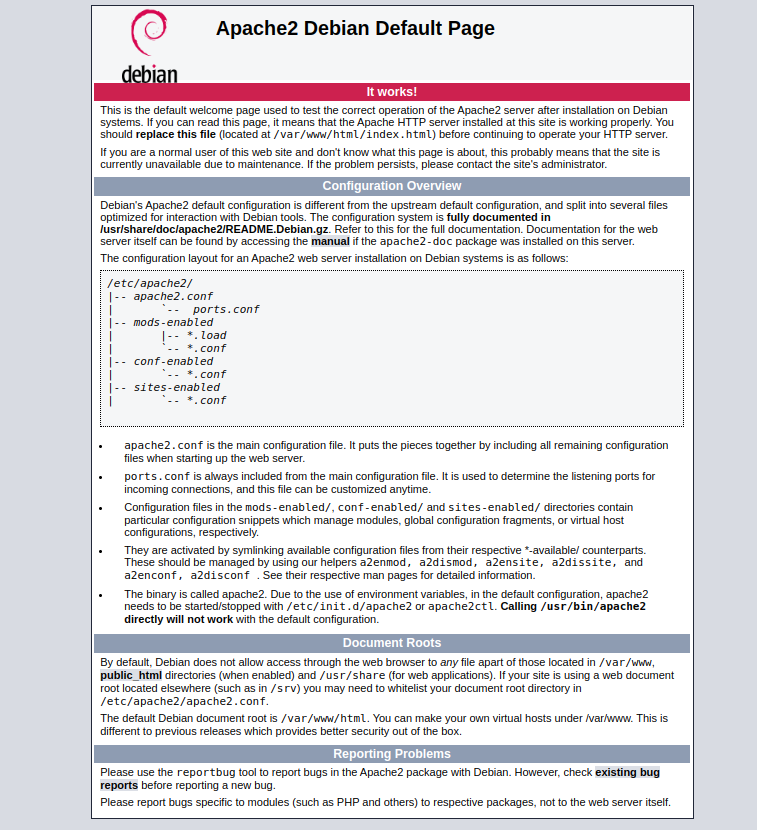

#### A list of available languages.
[en](./README.md) |

#### Pages
- [.htaccess](./HTACCESS.md)

# Apache web server
The [Apache HTTP Server](https://www.apache.org/) is a free and open-source cross-platform web server software, released under the terms of Apache License 2.0. Apache is developed and maintained by an open community of developers under the auspices of the Apache Software Foundation - `Wikipedia`

## Install
#### Debian

open terminal and enter this command
```
sudo apt install apache2
```

## Start, Stop and Restart
I'm using service command. To install service use `apt-get install sysvinit-utils`
<br />

**Start**
```
service apache2 start
```
Open browser and type `localhost` to access your server. You will see something like this.


<br />  

**Stop**
```
service apache2 stop
```

**Restart**  <br />
*Every time you edit something in apache configuration file you need to restart it.*
```
service apache2 restart
```

## Port
By default apache2 use port `80`. Change file content here `/etc/apache2/ports.conf`. The first `Listen 80` is default port. Apache will only listen port that is listed in this file. In this case just `80`. To listen more port just add `Listen {port}` next to `Listen 80`
```
# If you just change the port or add more ports here, you will likely also
# have to change the VirtualHost statement in
# /etc/apache2/sites-enabled/000-default.conf

Listen 80

//...
```

## Directory
Directory configurations file is located here `/etc/apache2/sites-enabled/000-default.conf`

### Change root directory
By default apache use port `80`, so we need to change port `80` configuration. If you changed default port then edit that port instead of `80`.
```
//...
<VirtualHost *:80>
        //...

        ServerAdmin webmaster@localhost
        DocumentRoot /var/www/html
         
        //...
</VirtualHost>
//...
```

### Add directory with a new port
Here I'm adding a path for port `8080` to store file like phpmyadmin, etc. <br />
**1.** Just duplicate port `80` configuration and replace port `80` with `8080` and changed Document root. In this case I'm using `/var/www/other`. <br />
**2.** Add [port](#port) 8080 to `ports.conf`
```
//...
<VirtualHost *:80>
  //...
</VirtualHost>


<VirtualHost *:8080>
 
  ServerAdmin webmaster@localhost
  DocumentRoot /var/www/other

  ErrorLog ${APACHE_LOG_DIR}/error.log
  CustomLog ${APACHE_LOG_DIR}/access.log combined

</VirtualHost>
```

**Please feel free to add something or translate it into your native language.** The contribution guidelines can be found [here](./CONTRIBUTING.md).
